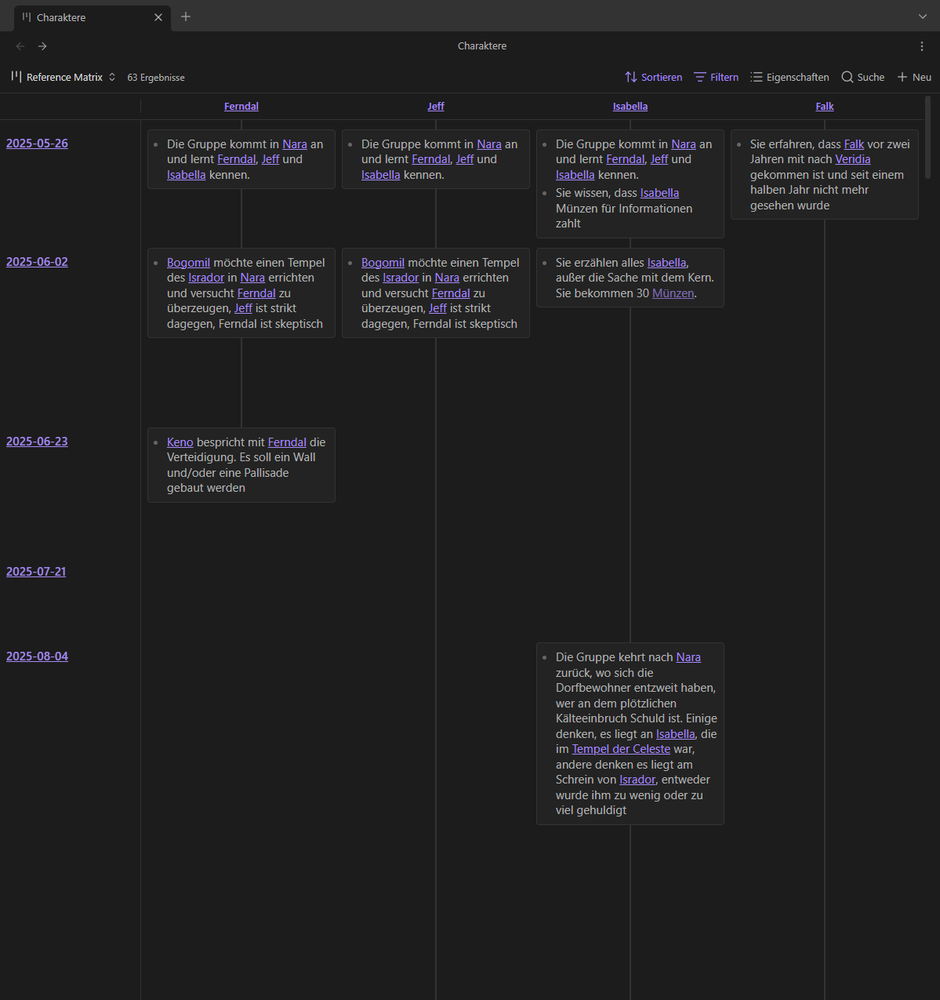
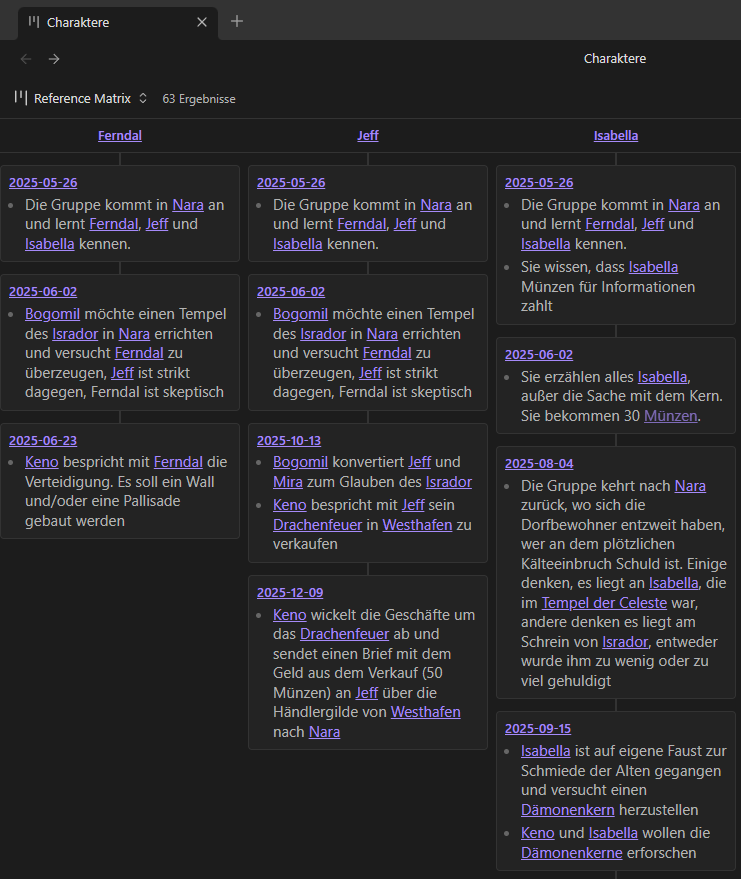

# Reference Matrix

An Obsidian [Bases](https://help.obsidian.md/bases) plugin that helps you track your references of the base's files from notes in another folder (the so-called *time axis* folder), e.g., daily notes, session logs, journal entries, etc.

Regular View

Compact Mode

## Motivation

I maintain a long running Pen & Paper session as a game master, where we create the world as we play, so lots and lots of information to keep track of. I maintain an obsidian vault with all the information about the world, as well as session logs, where I keep track of what has happened during a session.

I created the plugin to have an easy and quick way to see what has happened to a character, an item or a place after several sessions of play.

## Setup

1. Create or open a `.base` file.
2. Add a view and set its type to **Reference Matrix**.
3. Set **Time axis folder** to the folder in which you want to look for the references.
4. Use the base's filters to choose which files to look for.

## Options

- **Time axis folder**  The folder in which to look for references. Each file in the folder becomes a row in the view. Searched recursively, sorted by file name.
- **Compact view**  Drops the row axis. Each column becomes one stack of cells, every cell labelled with the **time axis** note it came from. Easier to read when references are sparse.

## What counts as a reference

Matching uses Obsidian's link cache, so a reference means the same thing as following the link:

- wikilinks and markdown links, aliases included — `[[Note|shown text]]`
- heading and block links — `[[Note#Heading]]`, `[[Note#^block]]`
- embeds — `![[Note]]`

Exception: Links in frontmatter properties are not shown.

## Requirements

Obsidian 1.10 or later, with the Bases core plugin enabled.
